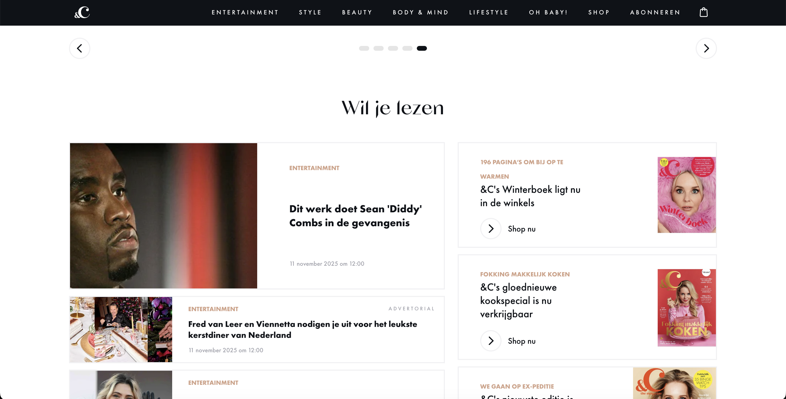
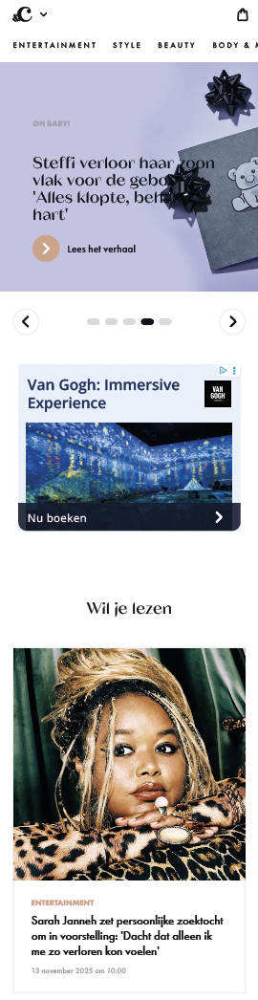
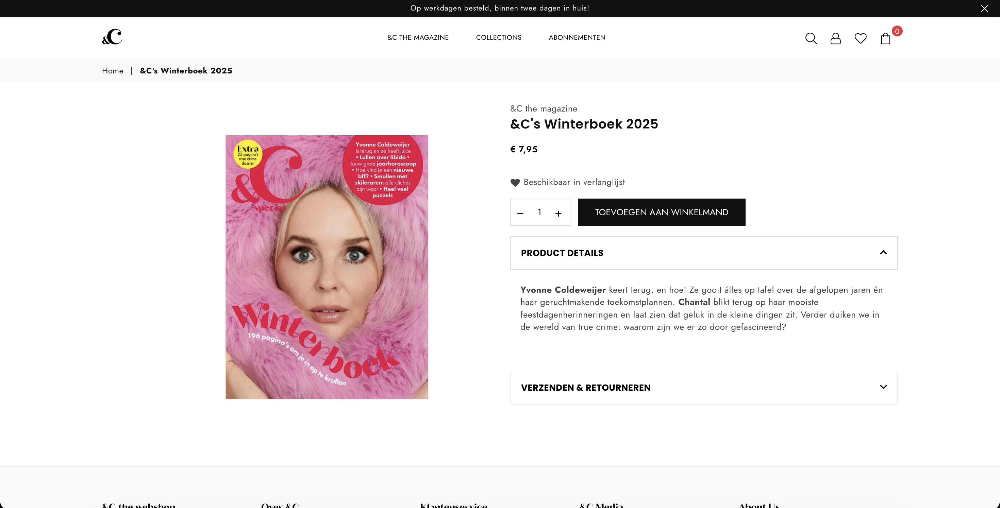

# Procesverslag
Markdown is een simpele manier om HTML te schrijven.  
Markdown cheat cheet: [Hulp bij het schrijven van Markdown](https://github.com/adam-p/markdown-here/wiki/Markdown-Cheatsheet).

Nb. De standaardstructuur en de spartaanse opmaak van de README.md zijn helemaal prima. Het gaat om de inhoud van je procesverslag. Besteedt de tijd voor pracht en praal aan je website.

Nb. Door *open* toe te voegen aan een *details* element kun je deze standaard open zetten. Fijn om dat steeds voor de relevante stuk(ken) te doen.

## Jij

  
uitwerken voor kick-off werkgroep

  ### Auteur:
  Jill Tervoort

  #### Je startniveau:
  Rood

  #### Je focus:
  Mijn focus wordt responsive
 

## Je website

  
uitwerken voor kick-off werkgroep

  ### Je opdracht:
  https://www.andc.tv/

  #### Screenshot(s) van de eerste pagina (small screen): 
  Homepagina  
  
  

  #### Screenshot(s) van de tweede pagina (small screen):
  Detailpagina shop  
  
  
 

## Toegankelijkheidstest 1/2 (week 1)

  
uitwerken na test in 2e werkgroep

  ### Bevindingen
  De dingen die mij waren opgevallen aan de hand van de toegankelijkheid test waren:

- Na het proberen van de screenreader vond ik dat veel omschrijven voor de elementen die geen tekst bevatten, niet sprekend genoeg waren. Graag zou ik in mijn eigen website meer omschrijvende alt-tags willen laten terug komen.
- De kleurcontrasten waren op sommige plekken te laag Hierdoor wordt het lastiger voor mensen met een visuele beperking om tekst te lezen.
- Er is geen dark mode of high-contrast modus beschikbaar. Dit zou de toegankelijkheid van de website nog meer omhoog kunnen krijgen.
- Verder is een het wel een rustige en overzichtelijke website om te zien. Er zijn bijvoorbeeld niet drukken animaties en werkt alles zoals het zou moeten doen. Ook vind ik dat de website goed semantisch correcte code doordat zij ook gebruik maken van H2tjes en H3tjes. 

## Breakdownschets (week 1)

  
uitwerken na afloop 3e werkgroep

  ### header + section 1: 
  

  ### section 2: 
  

  ### section 2 + section 3: 
  

  ### footer: 
  

## Voortgang 1 (week 2)

  
uitwerken voor 1e voortgang

  ### Stand van zaken
  Ik ben al lekker bezig geweest met het coderen van mijn website. ik ben bewust bezig met de theorie die ik gebruik en begrijp ik ook goed wat ik aan het doen ben. Gelukkig zitten er dan ook elementen in die ik goed kan herbruiken en net even aanpassen voor elementen die later terug komen op de website, hierdoor ben ik al een eindje gekomen. Ik denk dat het tot nu toe mij goed afgaat!

  ### Agenda voor meeting
  samen met je groepje opstellen

  | student 1      | student 2          | student 3    | student 4        |
  | ---            | ---                | ---          | ---              |
  | dit bespreken  | en dit             | en ik dit    | en dan ik dat    |
  | en dat ook nog | dit als er tijd is | nog een punt | dit wil ik zeker |
  | ...            | ...                | ...          | ...              |

  ### Verslag van meeting
  hier na afloop snel de uitkomsten van de meeting vastleggen

  - punt 1
  - punt 2
  - nog een punt
  - ...

## Voortgang 2 (week 3)

  
uitwerken voor 2e voortgang

  ### Stand van zaken
  hier dit ging goed & dit was lastig (neem ook screenshots op van delen van je website en code)

  ### Agenda voor meeting
  samen met je groepje opstellen

  | student 1      | student 2          | student 3    | student 4        |
  | ---            | ---                | ---          | ---              |
  | dit bespreken  | en dit             | en ik dit    | en dan ik dat    |
  | en dat ook nog | dit als er tijd is | nog een punt | dit wil ik zeker |
  | ...            | ...                | ...          | ...              |

  ### Verslag van meeting
  hier na afloop snel de uitkomsten van de meeting vastleggen

  - punt 1
  - punt 2
  - nog een punt
- ...

## Toegankelijkheidstest 2/2 (week 4)

  
uitwerken na test in 9e werkgroep

  ### Bevindingen
  Lijst met je bevindingen die in de test naar voren kwamen (geef ook aan wat er verbeterd is):

## Voortgang 3 (week 4)

  
uitwerken voor 3e voortgang

  ### Stand van zaken
  hier dit ging goed & dit was lastig (neem ook screenshots op van delen van je website en code)

  ### Agenda voor meeting
  samen met je groepje opstellen

  | student 1      | student 2          | student 3    | student 4        |
  | ---            | ---                | ---          | ---              |
  | dit bespreken  | en dit             | en ik dit    | en dan ik dat    |
  | en dat ook nog | dit als er tijd is | nog een punt | dit wil ik zeker |
  | ...            | ...                | ...          | ...              |

  ### Verslag van meeting
  hier na afloop snel de uitkomsten van de meeting vastleggen

  - punt 1
  - punt 2
  - nog een punt
  - ...

## Eindgesprek (week 5)

  
uitwerken voor eindgesprek

  ### Je uitkomst - karakteristiek screenshots:
  

  ### Dit ging goed/Heb ik geleerd: 
  Korte omschrijving met plaatjes

  

  ### Dit was lastig/Is niet gelukt:
  Korte omschrijving met plaatjes

  

## Bronnenlijst

  
continu bijhouden terwijl je werkt

  Nb. Wees specifiek ('css-tricks' als bron is bijv. niet specifiek genoeg). 
  Nb. ChatGpT en andere AI horen er ook bij.
  Nb. Vermeld de bronnen ook in je code.

  1. bron 1
  2. bron 2
  3. ...

