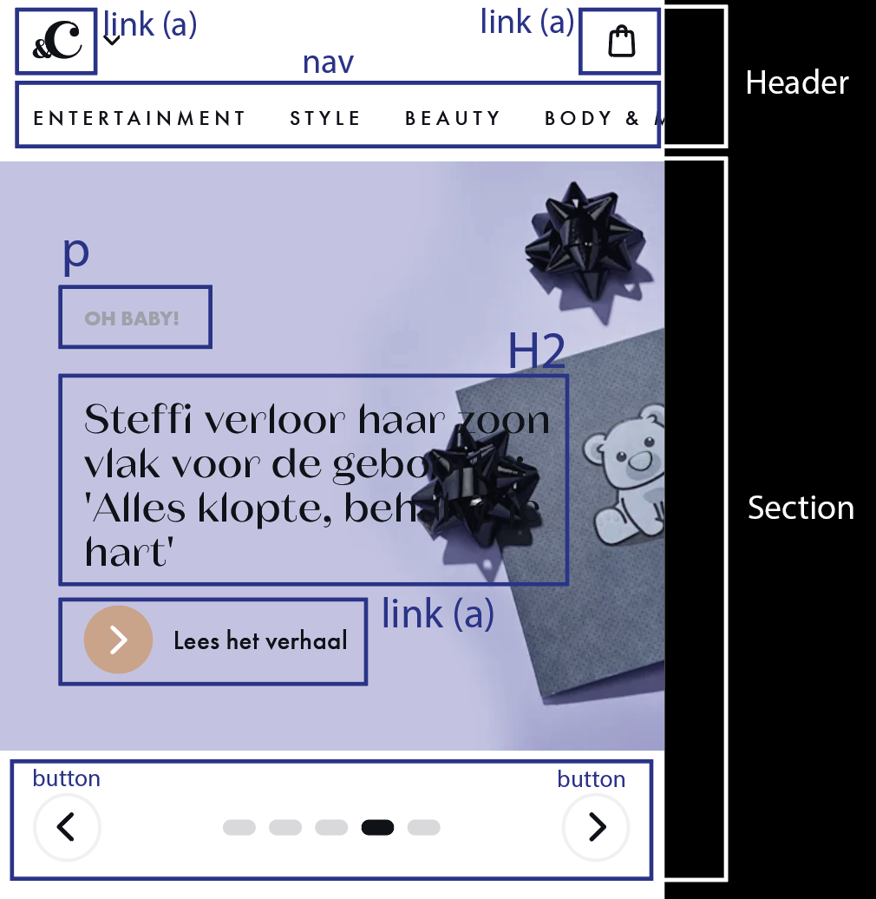
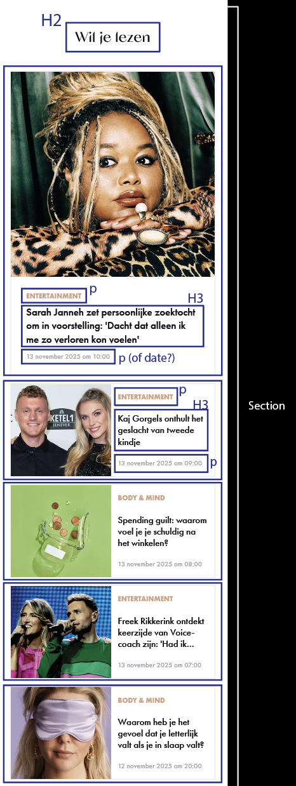
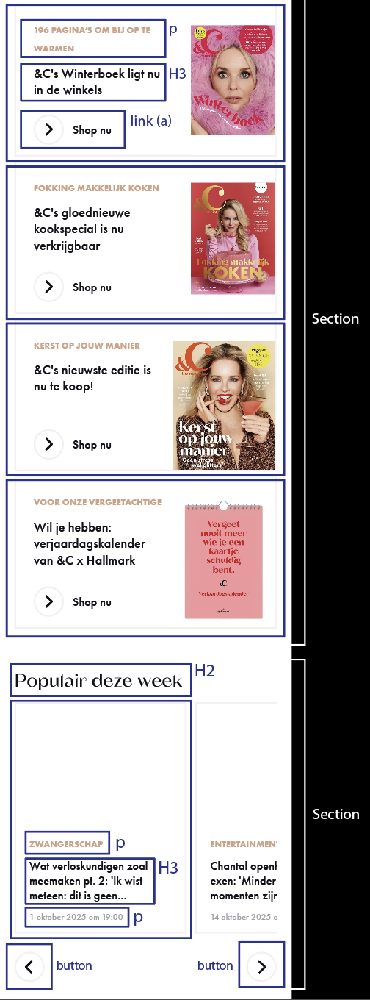
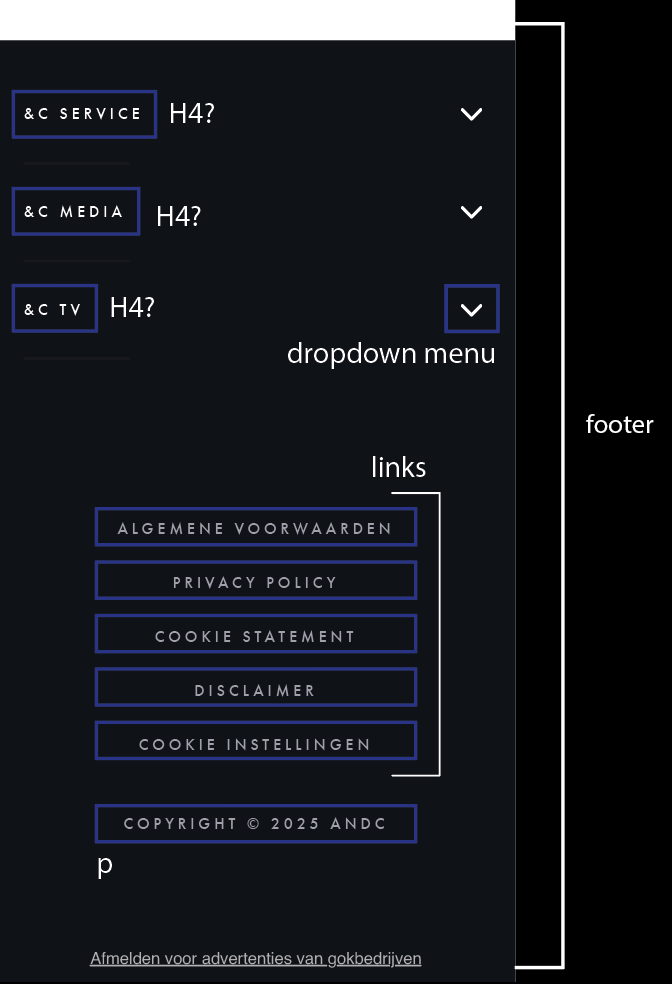
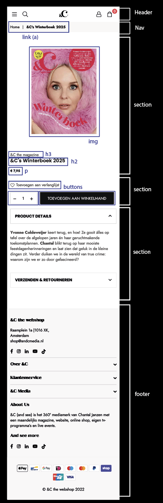

# Procesverslag
Markdown is een simpele manier om HTML te schrijven.  
Markdown cheat cheet: [Hulp bij het schrijven van Markdown](https://github.com/adam-p/markdown-here/wiki/Markdown-Cheatsheet).

Nb. De standaardstructuur en de spartaanse opmaak van de README.md zijn helemaal prima. Het gaat om de inhoud van je procesverslag. Besteedt de tijd voor pracht en praal aan je website.

Nb. Door *open* toe te voegen aan een *details* element kun je deze standaard open zetten. Fijn om dat steeds voor de relevante stuk(ken) te doen.

## Jij

  
uitwerken voor kick-off werkgroep

  ### Auteur:
  Jill Tervoort

  #### Je startniveau:
  Rood

  #### Je focus:
  Mijn focus wordt responsive
 

## Je website

  
uitwerken voor kick-off werkgroep

  ### Je opdracht:
  https://www.andc.tv/

  #### Screenshot(s) van de eerste pagina (small screen): 
  Homepagina  
  
  

  #### Screenshot(s) van de tweede pagina (small screen):
  Detailpagina shop  
  
  
 

## Toegankelijkheidstest 1/2 (week 1)

  
uitwerken na test in 2e werkgroep

  ### Bevindingen
  De dingen die mij waren opgevallen aan de hand van de toegankelijkheid test waren:

- Na het proberen van de screenreader vond ik dat veel omschrijven voor de elementen die geen tekst bevatten, niet sprekend genoeg waren. Graag zou ik in mijn eigen website meer omschrijvende alt-tags willen laten terug komen.
- naast dat ik niet erg handig ben met een screenreader, vind ik dat de screenreader niet onnodig veel informatie verteld en je een goede volgorde laat zien van de website.
- De kleurcontrasten waren op sommige plekken te laag, hierdoor wordt het lastiger voor mensen met een visuele beperking om tekst te lezen.
- Er is geen dark mode of high-contrast modus beschikbaar. Dit zou de toegankelijkheid van de website nog meer omhoog kunnen krijgen.
- voor sommige elementen gebruik de website buttons, terwijl dit een a'tje moet zijn.
- Verder is een een rustige en overzichtelijke website om te zien. Er zijn bijvoorbeeld geen drukke animaties en werkt alles zoals het zou moeten doen. Ook vind ik dat de website goed semantisch correcte code doordat zij ook gebruik maken van H2tjes en H3tjes. 

## Breakdownschets (week 1)

  
uitwerken na afloop 3e werkgroep

  ### header + section 1: 
  

  ### section 2: 
  

  ### section 2 + section 3: 
  

  ### footer: 
  

  ### pagina 2: 
  

## Voortgang 1 (week 2)

  
uitwerken voor 1e voortgang

  ### Stand van zaken
  Ik ben al lekker bezig geweest met het coderen van mijn website. ik ben bewust bezig met de theorie die ik gebruik en begrijp ik ook goed wat ik aan het doen ben. Gelukkig zitten er dan ook elementen in die ik goed kan herbruiken en net even aanpassen voor elementen die later terug komen op de website, hierdoor ben ik al een eindje gekomen. tijdens het opstellen van mijn html heb ik ook al een hoop css kunnen doen. Ik denk dat het tot nu toe mij goed afgaat!

  ### Agenda voor meeting

  vragen waarmee ik het voortgang gesprek in ga:
  - gebruik ik zo goed classes en divjes, of kunnen er daar nog een hele boel van weg?
  - klopt het hoe ik de buttons van de courousel heb neergezet of kan dit anders?
  - hoe zit het met de h1'tjes enz op mijn website?

  ### Verslag van meeting
  hier na afloop snel de uitkomsten van de meeting vastleggen

  - Ik kan veel minder classes en divjes gebruiken, ik moet meer gaan kijken naar selectoren.
  - ik kan beter een eigen img gebruiken dan dat ik er eentje via een website wil krijgen.
  - ik weet weer goed hoe ik verder kan gaan met mijn website.

## Voortgang 2 (week 3)

  
uitwerken voor 2e voortgang

  ### Stand van zaken
  - ik vind het goed dat ik 85% van mijn divjes en classes kunnen weghalen. Ik zie hierdoor ook in dat het erg onoverzichtelijk kan zijn om overal maar classes voor te maken en dat dit ook heel goed kan met de juiste elementen selecteren. Verder ben ik weer lekker bezig geweest met het verder werken aan mijn code. Ik ben van mening dat het mij nogsteeds goed afgaat en dat het erg fijn is dat als ik ergens tegenaan loop, het handig is om vragen stellen in de werkgroep. ik ben lekker bezig!

  ### Agenda voor meeting
   vragen waarmee ik het voortgang gesprek in ga:
  - klopt de java script code? of zie je gelijk dat het met behulp van ChatGPT is gemaakt?
  - ik wil gaan beginnen met het responsive maken van mijn website, maar waar begin ik? 
  - klopt de breakdownschets een beetje die ik gemaakt heb voor de tweede pagina?

  ### Verslag van meeting
  hier na afloop snel de uitkomsten van de meeting vastleggen

  - Ik weet nu goed hoe ik verder moet gaan met het responsive maken van mijn website.
  - ik heb de breakdown schets van mijn tweede pagina goed kunnen keuren en weet hoe ik de structuur van mijn html pagina moet opbouwen. 
  - Ik moet opnieuw nog eens gaan kijken naar de classes die ik gebruik.

## Toegankelijkheidstest 2/2 (week 4)

  
uitwerken na test in 9e werkgroep

  ### Bevindingen
  Lijst met je bevindingen die in de test naar voren kwamen (geef ook aan wat er verbeterd is):

  - na het doen van mijn eerste toegankelijkheidstest kwam ik erachter dat ik veel alt-tags nog onduidelijk vond. Dit wilde ik graag beter laten terugkomen op mijn eigen website. ik heb dit gedaan door een meer beschrijvende regel in de alt-tag toe te voegen, maar ook door arial-labels in mijn website te gebruiken wanneer er geen tekst gebruikt wordt. Ik kwam echter ook tot het inzicht dat je niet altijd op hele omschrijvende teksten zit te wachten en graag alleen de hoognodige dingen wilt horen. Met deze inzichten hoop ik een goed belans te hebben gecreerd op mijn eigen website.
  - mijn website heeft nu ook de mogelijkheid om een dark-modus aan te zetten, waardoor de website nu nog toegankelijker is voor de mensen die dat fijn vinden. De huidige website heeft namelijk niet zo'n modus.
  - doordat ik sommige kleurcontrasten heb versterkt, heb ik ervoor gezorgd dat ook mensen met een visuele beperking deze beter zouden moeten kunnen zien.
  - om een klein stukje toegankelijkheid de verbeteren heb ik geprobeerd om zo vaak mogelijk een &amp te gebruiken in plaats van een &-teken. Door namelijk een &amp te gebruiken weet de browser exact dat het letterlijk het ampersand-teken is. De screenreader leest dit dan ook correct als een “en”-teken of “ampersand”. hiermee hoopte ik fouten of verwaringen te voorkomen.
  - Verder heb ik de website zo vriendelijk mogelijk proberen te houden en heb ik de al overzichtelijke en duidelijke website na proberen te maken. de website bevat dan ook goed opgebouwde semantische code en gebruikt alleen divjes en classes waar het echt nodig is.

## Voortgang 3 (week 4)

  
uitwerken voor 3e voortgang

  ### Stand van zaken
  De deadline begint al in zicht te raken en er moet eigenlijk nog best veel gebeuren. Je verkijkt je af en toe op de tijd die in kleine dingentjes gaat zitten. Verder zijn er geen grote dingen waar ik tegenaanlooop en weet mij altijd goed te reden door het op te zoeken. Ik heb ook al grote stappen kunnen maken aan mijn tweede pagina en ben blij met de moeilijkere delen van mijn website die me gelukt zijn. zo is het gelukt om de knoppen van de carousels werkend te krijgen en het hamburger menu op de tweedepagina. ook begrijp ik goed hoe het responsive gedeelde in mekaar zit en ik denk dat ik daar de perfecte website voor heb uitgekozen. het is dus nog even knallen voor de deadline!

  ### Agenda voor meeting
  vragen waarmee ik het voortgang gesprek in ga:

  - zijn er nog laatste dingetjes die nog niet helemaal kloppen?
  

  ### Verslag van meeting

  - het is niet ideaal dat eigenlijk mijn tweede pagina anders is ingericht, zoals de header en de footer, dan de hoofdpagina. ik kan gaan kijken of ik sommige dingen misschien wel hetzelfde kan houden.
  - ik moet ook niet vergeten om mijn read-me goed bij te werken en nogeens kritisch naar de toeganklijkheid test kijken.
  - vooral de laatste dingetjes fixen die nog moeten gebeuren 

## Eindgesprek (week 5)

  
uitwerken voor eindgesprek

  ### Dit ging goed/Heb ik geleerd:
  Ik vind het erg goed van mijzelf dat ik nu geleerd heb hoe ik een website responsive moet maken. dit is dan ook een handige kwaliteit voor het maken van websites doordat realistisch gezien een website op heel veel verschillende apparaten bekeken kan worden. Ook heb ik weer heel veel nieuwe theorie geleerd en handige trucjes om zonder al teveel moeite dingen voor elkaar te krijgen. Ik ben tevreden met mijn eindresulaat en vind dat het goed gelukt is om de website na te kunnen maken.

  ### Dit was lastig/Is niet gelukt:
  Wat ik erg jammer vond is dat ik in tijd te kort kwam te zitten. ik baalde dat ik aan het einde keuzes moest maken met wat ik goed zou afmaken en wat ik moest laten liggen. ik had graag nog verder willen werken aan kleine details en weet dat sommige dingen mij ook zeker gelukt waren omdat ik ook wist hoe ik dit moest doen. een voorbeeld hiervan is de footer die ik niet responsive heb kunnen maken. al met al denk ik alsnog dat ik iets goeds heb neergezet, alleen is het wel jammer dat ik de kleine dingetjes niet verder heb kunnen uitwerken

## Bronnenlijst

  
continu bijhouden terwijl je werkt

  1. BRON: week 5: Dé JS 3-stap oefening 2 - Hamburger menu 
  2. BRON: ChatGPT, prompt: de section populairDezeWeek is een carousel met artikelen waar je doorheen kan swipen, nou staan hieronder ook twee buttons die ik werkend wil gaan maken. het is de bedoeling dat wanneer je op de button klikt, je een artikel opschuift en een volgende te zien krijg. hoe kan ik dit het gemakkelijkste maken?
  3. BRON: ChatGPT, prompt: ik ben de website &C aan het namaken. aan het begin van de website staat een carousel. je kunt door deze carousel niet scrollen, maar door op de pijltjes te klikken ga je naar het volgende artikel/list item. hoe zorg ik ervoor dat het listitem van de carousel het hele beeldscherm vult?
  4. BRON: https://www.a11yproject.com/posts/how-to-hide-content/
  5. BRON: https://css-tricks.com/snippets/css/complete-guide-grid/

